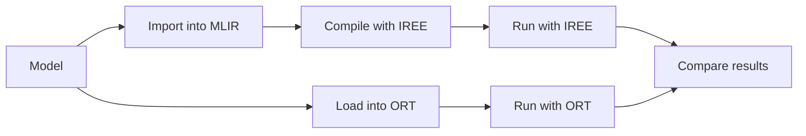

# ONNX Model Tests

This test suite exercises ONNX (Open Neural Network Exchange: https://onnx.ai/)
models. Most pretrained models are sourced from https://github.com/onnx/models.

Testing follows several stages:



## Quickstart

1. Set up your virtual environment and install requirements:

    ```bash
    python -m venv .venv
    source .venv/bin/activate
    python -m pip install -r requirements.txt
    ```

    * To use `iree-compile` and `iree-run-module` from Python packages:

        ```bash
        python -m pip install -r requirements-iree.txt
        ```

    * To use local versions of `iree-compile` and `iree-run-module`, put them on
      your `$PATH` ahead of your `.venv/Scripts` directory:

        ```bash
        export PATH=path/to/iree-build:$PATH
        ```

2. Run pytest using typical flags:

    ```bash
    pytest \
      -n auto \
      -rA \
      --timeout=30 \
      --durations=20 \
    ```

    See https://docs.pytest.org/en/stable/how-to/usage.html for other options.
