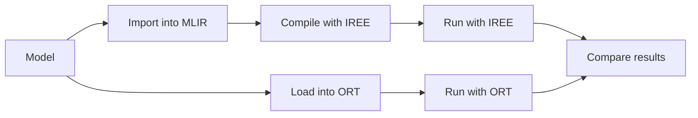

# ONNX Model Tests

This test suite exercises ONNX (Open Neural Network Exchange: https://onnx.ai/)
models. Most pretrained models are sourced from https://github.com/onnx/models.

Testing follows several stages:



## Quickstart

1. Set up your virtual environment and install requirements:

    ```bash
    python -m venv .venv
    source .venv/bin/activate
    python -m pip install -r requirements.txt
    ```

    * To use `iree-compile` and `iree-run-module` from Python packages:

        ```bash
        python -m pip install -r requirements-iree.txt
        ```

    * To use local versions of `iree-compile` and `iree-run-module`, put them on
      your `$PATH` ahead of your `.venv/Scripts` directory:

        ```bash
        export PATH=path/to/iree-build:$PATH
        ```

2. Run pytest using typical flags:

    ```bash
    pytest \
      -rA \
      --log-cli-level=info \
      --durations=0
    ```

    See https://docs.pytest.org/en/stable/how-to/usage.html for other options.

## Advanced pytest usage

* The `log-cli-level` level can also be set to `debug`, `warning`, or `error`.
  See https://docs.pytest.org/en/stable/how-to/logging.html.
* Run only tests matching a name pattern:

    ```bash
    pytest -k resnet
    ```

* Skip "large" tests using custom markers
  (https://docs.pytest.org/en/stable/example/markers.html):

    ```bash
    pytest -m "not size_large"
    ```

* Ignore xfail marks
  (https://docs.pytest.org/en/stable/how-to/skipping.html#ignoring-xfail):

    ```bash
    pytest --runxfail
    ```

* Run tests in parallel using https://pytest-xdist.readthedocs.io/
  (note that this swallows some logging):

    ```bash
    # Run with an automatic number of threads (usually one per CPU core).
    pytest -n auto

    # Run on an explicit number of threads.
    pytest -n 4
    ```

* Create an HTMl report using https://pytest-html.readthedocs.io/en/latest/index.html

    ```bash
    pytest --html=report.html --self-contained-html --log-cli-level=info
    ```

    See also
    https://docs.pytest.org/en/latest/how-to/output.html#creating-junitxml-format-files

## Debugging tests outside of pytest

Each test generates some files as it runs:

```text
├── artifacts
│ └── model_zoo
│   └── validated
│     └── vision
│       └── classification
│         ├── mnist-12_version17_cpu.vmfb      (Program compiled using IREE's llvm-cpu target)
│         ├── mnist-12_version17_input_0.bin   (Random input generated using numpy)
│         ├── mnist-12_version17_output_0.bin  (Reference output from onnxruntime)
│         ├── mnist-12_version17.mlir          (The model imported to MLIR)
│         ├── mnist-12_version17.onnx          (The model upgraded to a minimum supported version)
│         └── mnist-12.onnx                    (The downloaded ONNX model)
```

Running a test with logging enabled will show what the test is doing:

```console
pytest --log-cli-level=debug -k mnist

======================================= test session starts =======================================
platform win32 -- Python 3.11.2, pytest-8.3.3, pluggy-1.5.0
rootdir: D:\dev\projects\iree-test-suites\onnx_models
configfile: pytest.ini
plugins: reportlog-0.4.0, timeout-2.3.1, xdist-3.6.1
collected 17 items / 16 deselected / 1 selected

tests/model_zoo/validated/vision/classification_models_test.py::test_mnist
------------------------------------------ live log call ------------------------------------------
INFO     onnx_models.utils:utils.py:125 Upgrading 'artifacts\model_zoo\validated\vision\classification\mnist-12.onnx' to 'artifacts\model_zoo\validated\vision\classification\mnist-12_version17.onnx'
DEBUG    onnx_models.conftest:conftest.py:90 Session input [0]
DEBUG    onnx_models.conftest:conftest.py:91   name: 'Input3'
DEBUG    onnx_models.conftest:conftest.py:94   shape: [1, 1, 28, 28]
DEBUG    onnx_models.conftest:conftest.py:95   numpy shape: (1, 1, 28, 28)
DEBUG    onnx_models.conftest:conftest.py:96   type: 'tensor(float)'
DEBUG    onnx_models.conftest:conftest.py:97   iree parameter: 1x1x28x28xf32
DEBUG    onnx_models.conftest:conftest.py:129 Session output [0]
DEBUG    onnx_models.conftest:conftest.py:130   name: 'Plus214_Output_0'
DEBUG    onnx_models.conftest:conftest.py:131   shape (actual): (1, 10)
DEBUG    onnx_models.conftest:conftest.py:132   type (numpy): 'float32'
DEBUG    onnx_models.conftest:conftest.py:133   iree parameter: 1x10xf32
DEBUG    onnx_models.conftest:conftest.py:217 OnnxModelMetadata(inputs=[IreeModelParameterMetadata(name='Input3', type='1x1x28x28xf32', data_file=WindowsPath('D:/dev/projects/iree-test-suites/onnx_models/artifacts/model_zoo/validated/vision/classification/mnist-12_version17_input_0.bin'))], outputs=[IreeModelParameterMetadata(name='Plus214_Output_0', type='1x10xf32', data_file=WindowsPath('D:/dev/projects/iree-test-suites/onnx_models/artifacts/model_zoo/validated/vision/classification/mnist-12_version17_output_0.bin'))])
INFO     onnx_models.utils:utils.py:135 Importing 'artifacts\model_zoo\validated\vision\classification\mnist-12_version17.onnx' to 'artifacts\model_zoo\validated\vision\classification\mnist-12_version17.mlir'
INFO     onnx_models.conftest:conftest.py:160 Launching compile command:
  cd D:\dev\projects\iree-test-suites\onnx_models && iree-compile artifacts\model_zoo\validated\vision\classification\mnist-12_version17.mlir --iree-hal-target-backends=llvm-cpu -o artifacts\model_zoo\validated\vision\classification\mnist-12_version17_cpu.vmfb
INFO     onnx_models.conftest:conftest.py:180 Launching run command:
  cd D:\dev\projects\iree-test-suites\onnx_models && iree-run-module --module=artifacts\model_zoo\validated\vision\classification\mnist-12_version17_cpu.vmfb --device=local-task --input=1x1x28x28xf32=@artifacts\model_zoo\validated\vision\classification\mnist-12_version17_input_0.bin --expected_output=1x10xf32=@artifacts\model_zoo\validated\vision\classification\mnist-12_version17_output_0.bin
PASSED                                                                                       [100%]

================================ 1 passed, 16 deselected in 1.81s =================================
```

For this test case there is one input with shape/type `1x1x28x28xf32` stored at
`artifacts/model_zoo/validated/vision/classification/mnist-12_version17_input_0.bin` and one output
with shape/type `1x10xf32` stored at
`artifacts/model_zoo/validated/vision/classification/mnist-12_version17_output_0.bin`.

We can reproduce the compile and run commands with:

```bash
iree-compile \
  artifacts/model_zoo/validated/vision/classification/mnist-12_version17.mlir \
  --iree-hal-target-backends=llvm-cpu \
  -o artifacts/model_zoo/validated/vision/classification/mnist-12_version17_cpu.vmfb

iree-run-module \
  --module=artifacts/model_zoo/validated/vision/classification/mnist-12_version17_cpu.vmfb \
  --device=local-task \
  --input=1x1x28x28xf32=@artifacts/model_zoo/validated/vision/classification/mnist-12_version17_input_0.bin \
  --expected_output=1x10xf32=@artifacts/model_zoo/validated/vision/classification/mnist-12_version17_output_0.bin
```
